# Market Pattern Explorer

**I focused on learning and understanding the behaviour of features instead of trying to make a successful model.**

This is the central philosophy of this project. We did not set out to build a production-ready trading bot or a profitable strategy. Instead, we set out to understand *why* market prediction is hard, *how* features interact, and *where* models fail. The models themselves are tools for probing the data, not the end goal.

---

## What I Tried

I asked a simple question: **Can historical price data and technical indicators predict whether AAPL closes higher or lower tomorrow?**

I downloaded 5 years of Apple daily OHLCV data (Jan 2020 – Dec 2024), engineered 11 technical features from scratch, formulated binary classification targets, trained 4 models of increasing complexity, backtested them, and compared everything against a simple Buy & Hold benchmark.

The short answer: **No, not reliably.** The best model (LSTM) achieved 45.8% accuracy — barely above a coin flip. Every ML strategy was outperformed by Buy & Hold (+37% cumulative return). But the *why* behind these failures is where the real learning lives.

### Project Pipeline

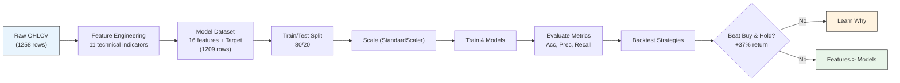

---

## Key Learnings About Feature Engineering

### 1. The Noise-vs-Lag Tradeoff Is Everywhere

Every feature we engineered forced us to choose between **reactivity** and **reliability**:

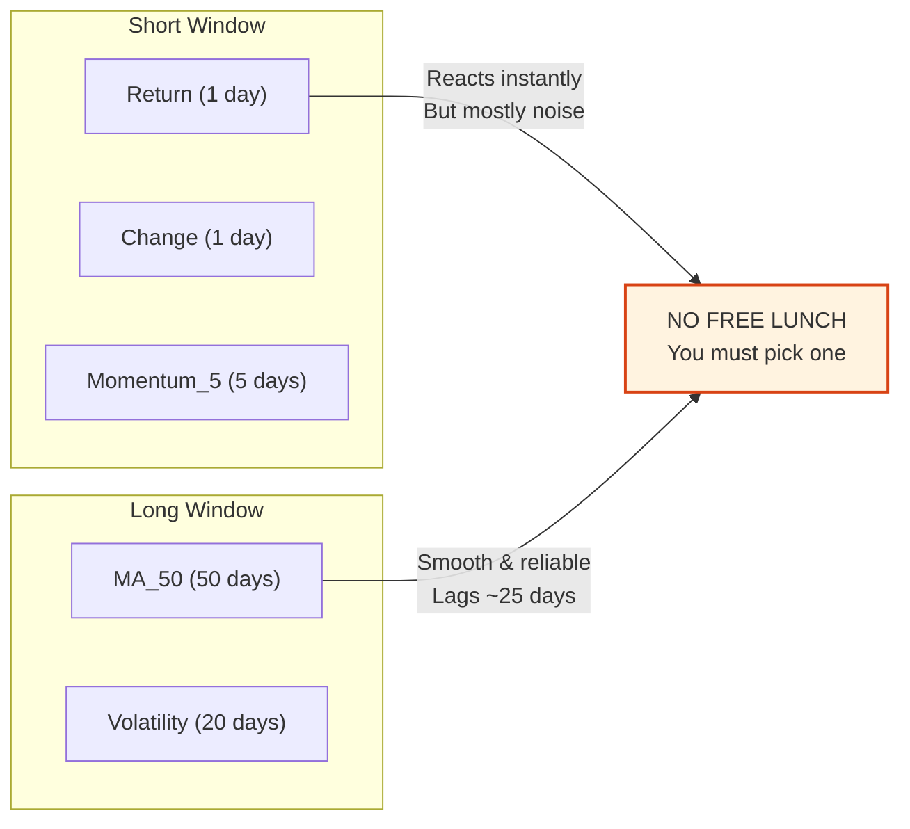

- **Short-window features** (Return, Change, Momentum_5) react instantly to new price moves. But they are dominated by random noise — most day-to-day movement is meaningless.
- **Long-window features** (MA_50, Volatility) smooth away noise beautifully. But they lag reality by days or weeks. MA_50 trails price by ~25 days on average.
- There is **no free lunch**. You cannot have zero lag and zero noise simultaneously. Every modeling decision inherits this tradeoff from the feature engineering step.

### 2. Stationarity Matters More Than Complexity

Raw price is non-stationary — its mean and variance drift over time. Models trained on raw prices fail when the price level changes. **Percentage returns** solved this: they normalize price changes to be scale-independent and approximately stationary. This single transformation had more impact on model stability than switching from Logistic Regression to XGBoost.

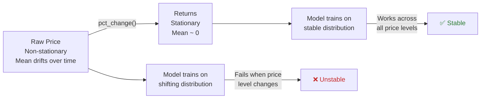

### 3. Feature Distributions Reveal the Market's Nature

Visualizing each feature taught us more than any model metric:

- **Returns** cluster near zero with fat tails — small moves dominate, big moves are rare.
- **RSI** rarely hits extreme zones (above 70 or below 30) during strong trends, limiting its signal value.
- **MACD components** are highly correlated with each other (MACD, Signal, Histogram) — including all three risks multicollinearity.
- **Volume_Change** is extremely volatile — 50%+ swings are common, making it a noisy predictor at daily frequency.

### 4. Feature Engineering Is Where the Signal Lives

Every model — from a simple linear classifier to a 53,825-parameter LSTM — received the *same* 16 features. The accuracy range across all models was just **40.1%–45.8%**.

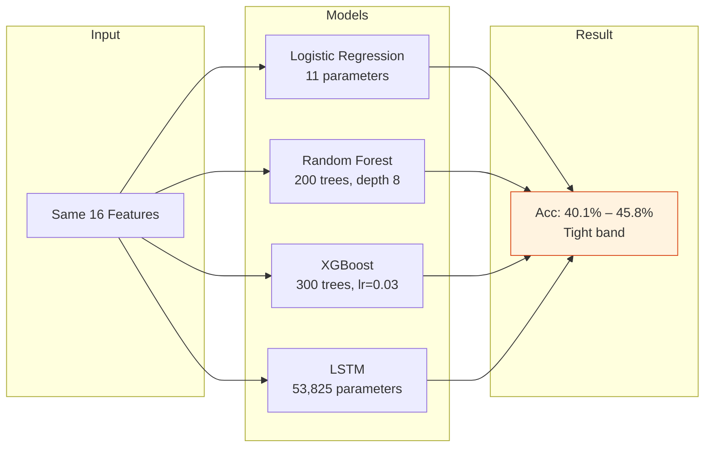

This tight band tells us something profound: **the ceiling on performance is set by the features, not the model**. Adding better features (sentiment, order book, macro data) would likely improve performance far more than switching from XGBoost to a Transformer.

### 5. The Target Definition Shapes Everything

Our target was `(Close.shift(-1) > Close).astype(int)` — tomorrow up or not? This binary framing discards magnitude information. A day that closes +0.1% and a day that closes +5% are both labeled "1". A model that perfectly predicts direction but ignores size cannot produce a profitable strategy. This is a feature engineering decision (how we define the target) that directly causes the accuracy–profitability disconnect we later discovered in backtesting.

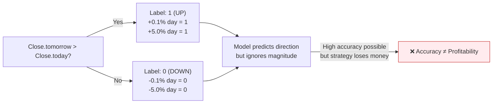

---

## The Data

| File                                                  | Description                                                                                                                 | Rows |
| ----------------------------------------------------- | --------------------------------------------------------------------------------------------------------------------------- | ---- |
| [`data/btc_usd_daily.csv`](data/btc_usd_daily.csv)   | Raw AAPL OHLCV from Yahoo Finance (2020-01-02 to 2024-12-31)                                                                | 1258 |
| [`data/btc_features.csv`](data/btc_features.csv)     | Engineered features: Change, Return, Volume_Change, Momentum_5, MA_10, MA_50, Volatility, RSI, MACD, MACD_Signal, MACD_Hist | 1258 |
| [`data/btc_model_data.csv`](data/btc_model_data.csv) | Features + Target (binary direction label) after dropna()                                                                   | 1209 |

> **Note:** All three files are CSV. The file names contain "btc" but the data is Apple (AAPL) — a naming artifact from early exploration.

### Data Processing Flow

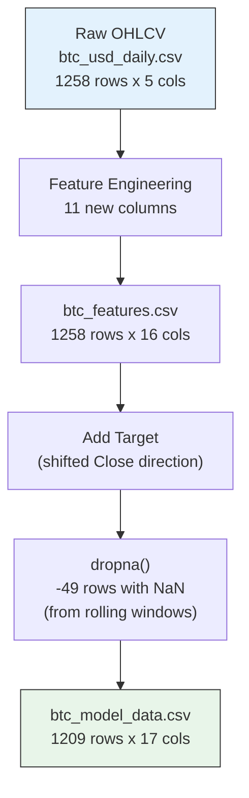

---

## The Models

> **Benchmark:** Buy & Hold returned **+37%** with a Sharpe ratio of ~0.40. Every ML strategy underperformed this simple baseline.

| Model               | File                                                                | Accuracy                                       | Precision | Recall | Sharpe |
| ------------------- | ------------------------------------------------------------------- | ---------------------------------------------- | --------- | ------ | ------ |
| Logistic Regression | [`models/logistic_regression.pkl`](models/logistic_regression.pkl) | 40.91%                                         | 46.67%    | 20.14% | -1.94  |
| Random Forest       | [`models/random_forest.pkl`](models/random_forest.pkl)             | 43.0%                                          | 52.0%     | 17.0%  | 0.21   |
| XGBoost             | [`models/xgboost.pkl`](models/xgboost.pkl)                         | 40.08%                                         | 44.0%     | 15.83% | 0.13   |
| LSTM                | [`models/lstm_model.keras`](models/lstm_model.keras)               | 45.76%                                         | 53.47%    | 40.0%  | N/A    |
| Scaler              | [`models/scaler.pkl`](models/scaler.pkl)                           | StandardScaler (16 features, for classical ML) |           |        |        |

### Model Training Pipeline

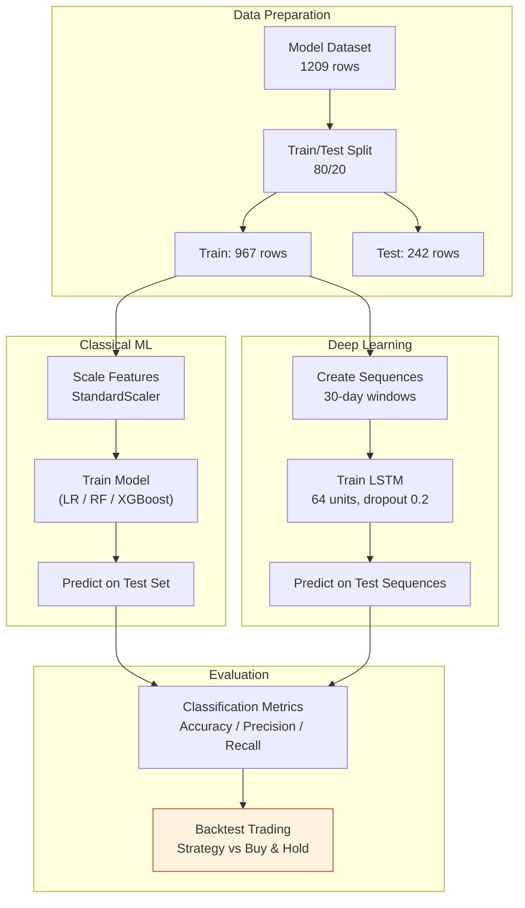

---

## Step by Step: The Full Research Journey

### Step 1: Data Exploration — [`notebooks/01_dataexplorer.ipynb`](notebooks/01_dataexplorer.ipynb)

Downloaded AAPL daily data via `yfinance` for 2020–2024. Inspected structure, missing values (none), and basic statistics. The data was clean — no preprocessing needed beyond saving to CSV.

**Key cell — loading data:**

```python
import yfinance as yf
df = yf.download("AAPL", start="2020-01-01", end="2025-01-01", interval="1d")
```

> **Key observation:** `df.isna().sum()` returned all zeros. Clean data from the start.

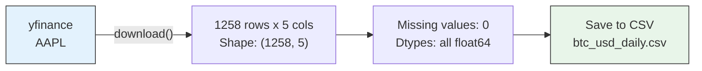

### Step 2: Feature Engineering — [`notebooks/02_feature_engineering.ipynb`](notebooks/02_feature_engineering.ipynb)

This was the heart of the project. We built 11 features from raw OHLCV, each with its own documented rationale, formula, visualization, and limitations:

| #  | Feature                 | Formula                      | Purpose                                |
| -- | ----------------------- | ---------------------------- | -------------------------------------- |
| 1  | **Change**        | `Close - Open`             | Candle sentiment — bullish or bearish |
| 2  | **Return**        | `Close.pct_change()`       | Scale-independent daily move           |
| 3  | **Volume_Change** | `Volume.pct_change()`      | Participation shift detection          |
| 4  | **Momentum_5**    | `Close - Close.shift(5)`   | 5-day price acceleration               |
| 5  | **MA_10**         | `Close.rolling(10).mean()` | Short-term trend                       |
| 6  | **MA_50**         | `Close.rolling(50).mean()` | Long-term trend                        |
| 7  | **Volatility**    | `Return.rolling(20).std()` | 20-day price fluctuation               |
| 8  | **RSI**           | 14-period RSI from`ta`     | Momentum oscillator (0-100)            |
| 9  | **MACD**          | `EMA_12 - EMA_26`          | Trend-momentum hybrid                  |
| 10 | **MACD_Signal**   | `EMA_9 of MACD`            | Signal line for crossovers             |
| 11 | **MACD_Hist**     | `MACD - Signal`            | Momentum acceleration                  |

**Key cell — computing RSI:**

```python
from ta.momentum import RSIIndicator
df['RSI'] = RSIIndicator(df['Close']).rsi()
```

Each feature includes a "Limitations" section in the notebook — e.g., for Change:

> *"A single candle does not describe the overall trend. Large candles may occur because of news or sudden volatility."*

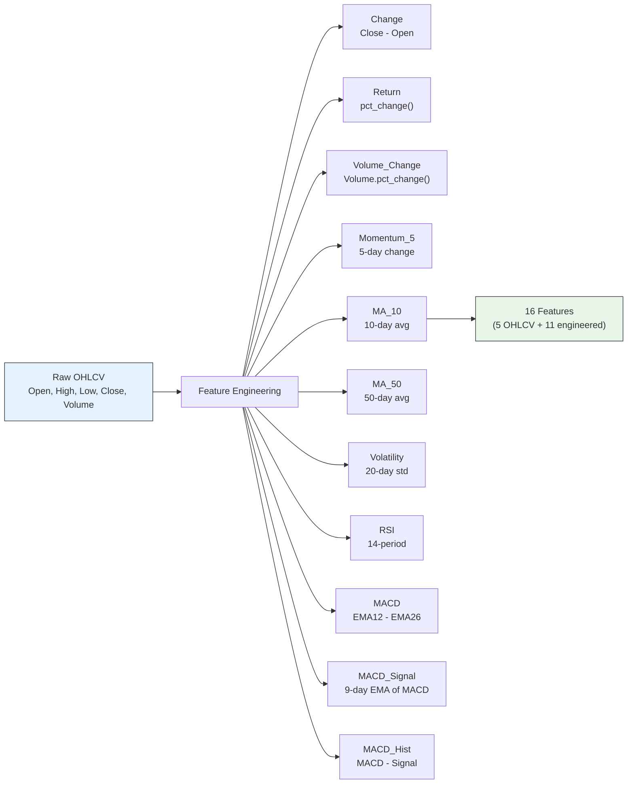

### Step 3: Target Creation & Dataset Assembly — [`notebooks/03_target_and_dataset.ipynb`](notebooks/03_target_and_dataset.ipynb)

Formulated as binary classification:

```python
df["Target"] = (df["Close"].shift(-1) > df["Close"]).astype(int)
```

> **Key finding:** Class balance: ~53.5% UP, ~46.5% DOWN. Slightly imbalanced but not severely.

**Final feature set (16):** Open, High, Low, Close, Volume, Change, Return, Volume_Change, Momentum_5, MA_10, MA_50, Volatility, RSI, MACD, MACD_Signal, MACD_Hist.

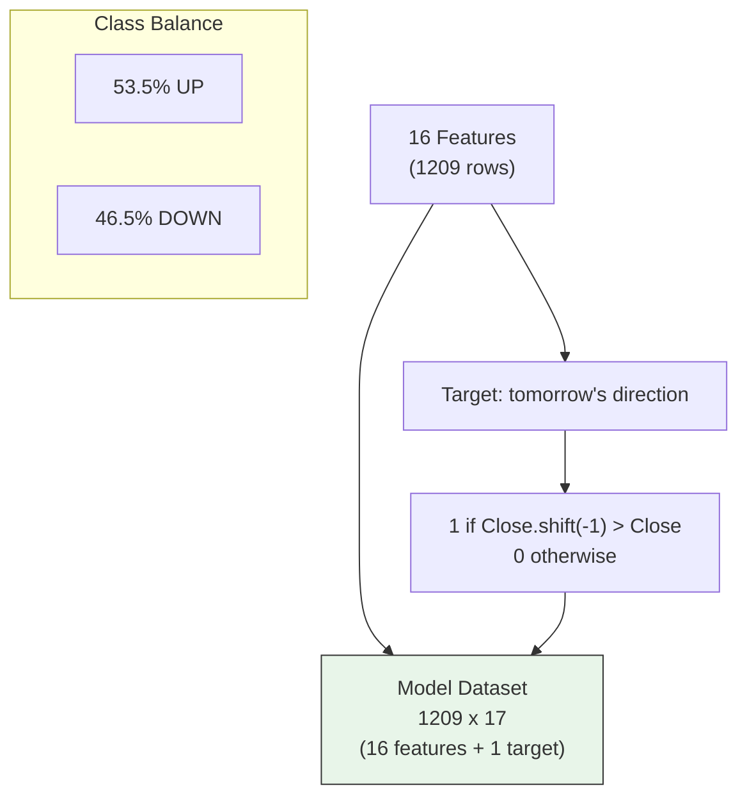

### Step 4: Logistic Regression Baseline — [`notebooks/05_logistic_regression.ipynb`](notebooks/05_logistic_regression.ipynb)

> **Rationale:** "Logistic Regression is simple, fast, and interpretable. It establishes a baseline performance against which more advanced models can be compared."

**Key output — coefficients revealed feature direction:**

```
Return coefficient: -0.30 (mean reversion signal)
```

When Return is very positive, the model predicts DOWN — large up-moves tend to reverse.

**Results:** Accuracy 40.91%, Precision 46.67%, Recall 20.14%.

### Step 5: Random Forest — [`notebooks/06_random_forest.ipynb`](notebooks/06_random_forest.ipynb)

> **Rationale:** "Logistic Regression assumes linearity. Markets are non-linear. Random Forest captures non-linear patterns."

**Configuration:** 200 estimators, `max_depth=8`. No feature scaling needed.

**Results:** Accuracy 43.0%, Precision 52.0%, Recall 17.0%. Slightly better accuracy and best precision. But recall dropped — RF caught fewer up-moves than LR.

### Step 6: XGBoost — [`notebooks/07_xgboost.ipynb`](notebooks/07_xgboost.ipynb)

> **Rationale:** "Each new tree attempts to correct the mistakes made by previous trees."

**Configuration:** 300 estimators, `learning_rate=0.03`, `max_depth=4`.

**Results:** Accuracy 40.08%, Precision 44.0%, Recall 15.83%. **Worst overall performance** — the sequential correction added variance without benefit on our small dataset (967 training rows).

### Step 7: Model Comparison — [`notebooks/08_model_comparison.ipynb`](notebooks/08_model_comparison.ipynb)

Side-by-side comparison with bar charts. The critical insight from this notebook:

> *"Model complexity did not improve performance. More advanced algorithms such as Random Forest and XGBoost did not significantly outperform Logistic Regression. This suggests that the limiting factor is not the choice of model but the information contained in the features."*

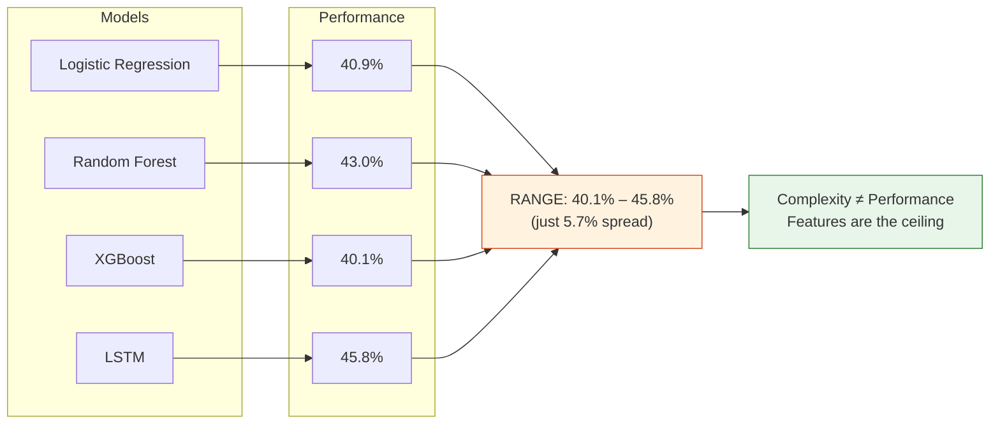

**Four key findings:**

1. **Model complexity ≠ better performance** — LR, RF, XGBoost, and LSTM all landed within ~5% of each other
2. **Technical indicators alone provide limited predictive power** — no model crossed 50% accuracy
3. **The market signal appears weak** — all models near random guessing, suggesting efficient market effects at daily frequency
4. **Future work directions** — sentiment analysis, macroeconomic data, longer prediction horizons

### Step 8: Backtesting — [`notebooks/09_backtesting.ipynb`](notebooks/09_backtesting.ipynb)

This is where the project's most important lesson emerged. We simulated trading: predict UP → buy/hold, predict DOWN → stay in cash. No leverage, no transaction costs.

> **Key finding:** Cumulative returns chart showed **Buy & Hold (+37%) crushing every ML strategy**.

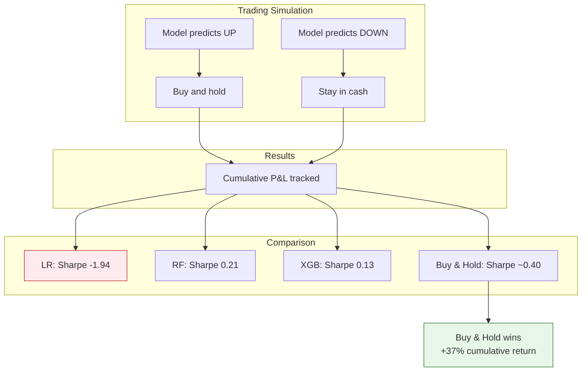

| Strategy            | Sharpe Ratio |
| ------------------- | ------------ |
| Logistic Regression | -1.94        |
| Random Forest       | 0.21         |
| XGBoost             | 0.13         |
| Buy & Hold          | ~0.40        |

> *"Even though Random Forest achieved better classification metrics, it failed to outperform simply holding Apple stock."*

### Step 9: LSTM Model — [`notebooks/10_lstm_model.ipynb`](notebooks/10_lstm_model.ipynb)

LSTM processes 30-day sequences rather than individual rows. Architecture: `LSTM(64 units) → Dropout(0.2) → Dense(1, sigmoid)`. **53,825 parameters on 967 training samples.**

**Results:** Accuracy 45.76% (best), Precision 53.47% (best), Recall 40.0% (best). But with 55x more parameters than training samples, overfitting risk is severe.

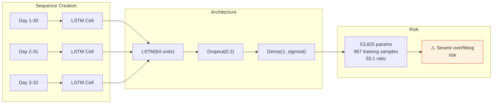

### Step 10: Final Report — [`reports/final_report.ipynb`](reports/final_report.ipynb)

A comprehensive write-up consolidating all findings, including 3 key failed assumptions and future work directions.

---

## Where We Failed and How

### Failure 1: "More complexity = better results"

We assumed Random Forest would beat Logistic Regression, XGBoost would beat Random Forest, and LSTM would beat everything. The accuracy range across all 4 models was just **40.1%–45.8%**. Complexity added variance, not signal.

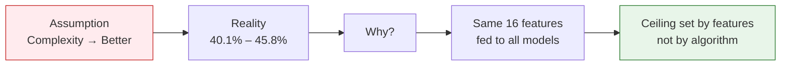

**Why:** The ceiling is set by the features, not the model. All models saw the same 16 features. No amount of algorithmic sophistication can extract information that simply isn't there.

### Failure 2: "Accuracy equals profitability"

Logistic Regression had 40.9% accuracy. Random Forest had 43.0%. By this measure, RF was "better." But in backtesting, LR's Sharpe was -1.94 (terrible) and RF's Sharpe was 0.21 (mediocre). Meanwhile Buy & Hold (+37% return, ~0.40 Sharpe) outperformed everything despite being "directionless" as a model.

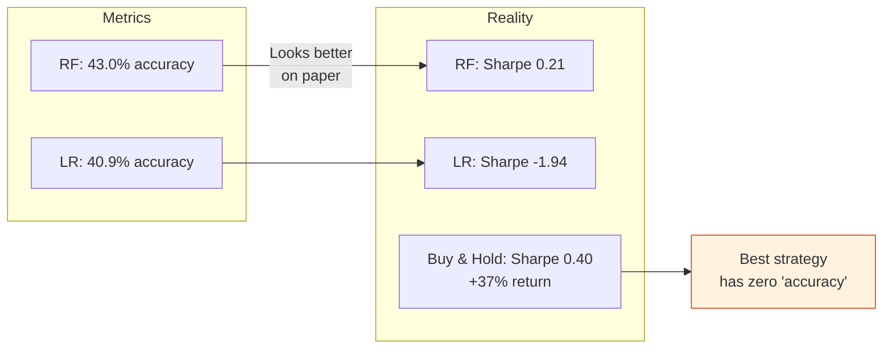

**Why:** Accuracy ignores magnitude, risk, and market participation. A model that is wrong often but badly wrong can destroy capital faster than a model that is wrong slightly less often but is right in bigger moves.

### Failure 3: "Technical indicators are enough"

We used 16 features including RSI, MACD, moving averages, and volatility — a comprehensive technical toolkit. The models still couldn't beat Buy & Hold.

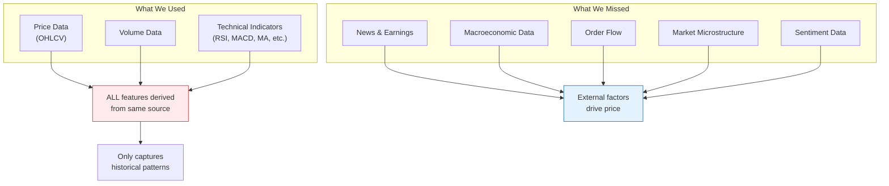

**Why:** Technical indicators are derived from the same data (price and volume). They capture only historical patterns. They do not capture news, earnings, macroeconomic shifts, order flow, or market microstructure. In efficient markets, these external factors are what drive price.

---


---

## Project Structure

```
Market Pattern Explorer/
├── data/
│   ├── btc_usd_daily.csv         # Raw AAPL OHLCV
│   ├── btc_features.csv          # Engineered features
│   └── btc_model_data.csv        # Features + Target
├── models/
│   ├── logistic_regression.pkl   # Trained LR
│   ├── random_forest.pkl         # Trained RF (200 trees, depth 8)
│   ├── xgboost.pkl               # Trained XGB (300 trees, lr=0.03)
│   ├── lstm_model.keras          # Trained LSTM (64 units, 30-day sequences)
│   └── scaler.pkl                # StandardScaler (16 features)
├── notebooks/
│   ├── 01_dataexplorer.ipynb     # Data download + inspection
│   ├── 02_feature_engineering.ipynb  # 11 features from scratch
│   ├── 03_target_and_dataset.ipynb   # Target + feature selection
│   ├── 05_logistic_regression.ipynb  # Baseline model
│   ├── 06_random_forest.ipynb        # Non-linear ensemble
│   ├── 07_xgboost.ipynb              # Gradient boosting
│   ├── 08_model_comparison.ipynb     # Side-by-side metrics
│   ├── 09_backtesting.ipynb          # Trading simulation
│   └── 10_lstm_model.ipynb           # Deep learning with sequences
├── reports/
│   └── final_report.ipynb        # Comprehensive write-up
└── README.md
```

### Architecture Flow

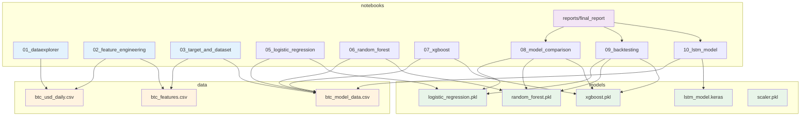

---

## Final Thoughts

This project did not produce a profitable trading strategy. It produced something more valuable: a deep, hands-on understanding of why market prediction is hard. The models taught us about the noise ceiling in financial data, the primacy of feature engineering over model selection, and the dangerous gap between classification metrics and real-world trading performance.

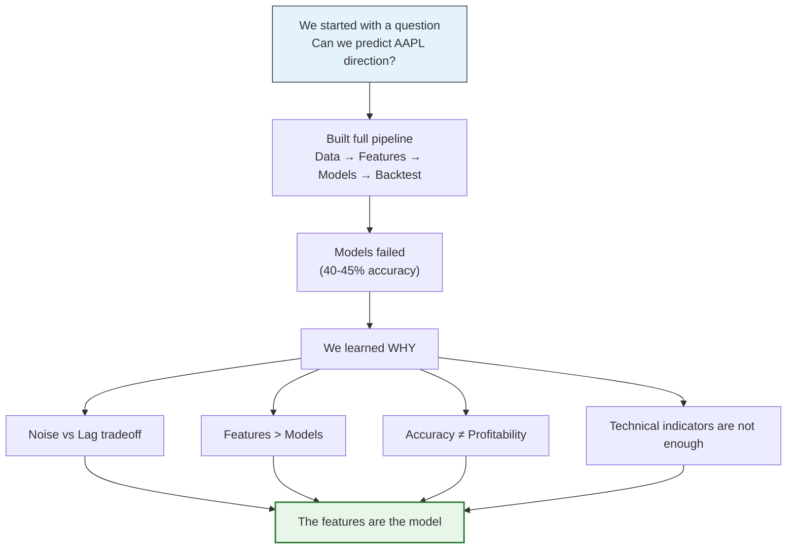

If we learned one thing, it is this: **the features are the model.**
